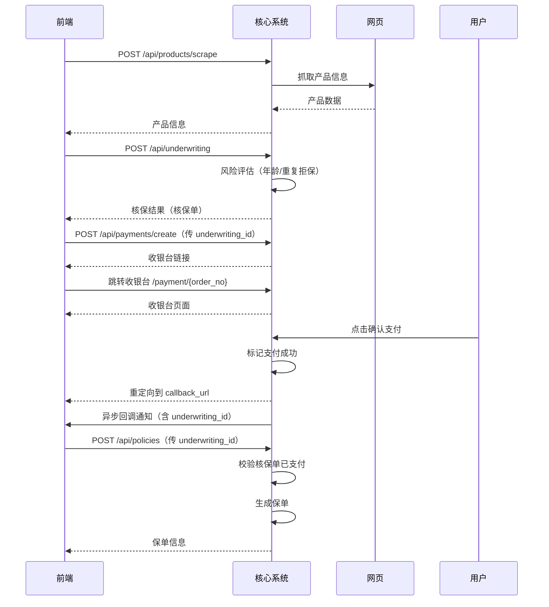

# 保险公司核心系统 - API 接口文档

Base URL: `http://localhost:8000`

---

## 目录

- [1. 产品模块](#1-产品模块)
- [2. 核保模块](#2-核保模块)
- [3. 承保模块](#3-承保模块)
- [4. 支付模块](#4-支付模块)
- [5. 页面路由](#5-页面路由)
- [6. 公共](#6-公共)
- [附录：业务流程图](#附录业务流程图)

---

## 1. 产品模块

### 1.1 抓取产品信息

从指定网页抓取产品信息并存入数据库。仅保存一个产品，重复抓取会覆盖已有数据。

```
POST /api/products/scrape
```

**Response 200**

```json
{
  "id": 1,
  "product_name": "中邮普惠保险",
  "insurance_type": "普惠保险",
  "insurance_period": "1年",
  "payment_period": "一次性缴清",
  "sum_insured": "100000.00",
  "premium": "100.00",
  "created_at": "2026-05-17T00:00:00"
}
```

**Response 502** — 抓取失败

```json
{
  "detail": {
    "code": "SCRAPE_FAILED",
    "message": "抓取产品信息失败: Connection error"
  }
}
```

---

### 1.2 产品列表

```
GET /api/products
```

**Response 200**

```json
{
  "products": [
    {
      "id": 1,
      "product_name": "中邮普惠保险",
      "insurance_type": "普惠保险",
      "insurance_period": "1年",
      "payment_period": "一次性缴清",
      "sum_insured": "100000.00",
      "premium": "100.00",
      "created_at": "2026-05-17T00:00:00"
    }
  ]
}
```

---

### 1.3 产品详情

```
GET /api/products/{product_id}
```

**Response 200**

```json
{
  "id": 1,
  "product_name": "中邮普惠保险",
  "insurance_type": "普惠保险",
  "insurance_period": "1年",
  "payment_period": "一次性缴清",
  "sum_insured": "100000.00",
  "premium": "100.00",
  "created_at": "2026-05-17T00:00:00"
}
```

**Response 404**

```json
{
  "detail": {
    "code": "PRODUCT_NOT_FOUND",
    "message": "产品不存在"
  }
}
```

---

## 2. 核保模块

### 2.1 提交核保申请

提交投保人和被保人信息进行风险评估。

**核保规则：**
- 被保人年龄须在 18-65 周岁（含）
- 同一被保人没有未结清的拒保记录

```
POST /api/underwriting
```

**Request Body**

| 字段 | 类型 | 说明 | 校验规则 |
|------|------|------|---------|
| product_id | int | 产品 ID | 必填 |
| applicant_name | string | 投保人姓名 | 1-100 字符 |
| applicant_id_no | string | 投保人身份证号 | 18 位数字或末尾 X/x |
| insured_name | string | 被保人姓名 | 1-100 字符 |
| insured_id_no | string | 被保人身份证号 | 18 位数字或末尾 X/x |
| insured_age | int | 被保人年龄 | 0-150 |

```json
{
  "product_id": 1,
  "applicant_name": "张三",
  "applicant_id_no": "110101199001011234",
  "insured_name": "李四",
  "insured_id_no": "110101199505052345",
  "insured_age": 30
}
```

**Response 201**

```json
{
  "id": 1,
  "product_id": 1,
  "applicant_name": "张三",
  "insured_name": "李四",
  "insured_age": 30,
  "status": "approved",
  "reject_reason": null,
  "created_at": "2026-05-17T00:00:00"
}
```

**Response 400** — 核保拒绝

```json
{
  "detail": {
    "code": "UNDERWRITING_REJECTED",
    "message": "被保人年龄 70 不在承保范围（18-65周岁）"
  }
}
```

**Response 422** — 参数校验失败

```json
{
  "detail": [
    {
      "loc": ["body", "applicant_id_no"],
      "msg": "String must match pattern '^\\d{17}[\\dXx]$'",
      "type": "string_pattern_mismatch"
    }
  ]
}
```

---

### 2.2 查询核保结果

```
GET /api/underwriting/{underwriting_id}
```

**Response 200**

```json
{
  "id": 1,
  "product_id": 1,
  "applicant_name": "张三",
  "insured_name": "李四",
  "insured_age": 30,
  "status": "approved",
  "reject_reason": null,
  "created_at": "2026-05-17T00:00:00"
}
```

**Response 404**

```json
{
  "detail": {
    "code": "RECORD_NOT_FOUND",
    "message": "核保记录不存在"
  }
}
```

---

## 3. 承保模块

### 3.1 生成保单（承保）

核保单支付成功后，前端调用此接口完成承保。系统会先校验该核保单是否已支付成功，通过后生成保单。同一核保记录只能出单一次。

**前置条件：** 该核保记录已通过审批且支付成功

**保单号格式：** `P{YYYYMMDD}{6位序列号}`

```
POST /api/policies
```

**Request Body**

| 字段 | 类型 | 说明 |
|------|------|------|
| underwriting_id | int | 核保记录 ID（须为 approved 状态且已支付） |

```json
{
  "underwriting_id": 1
}
```

**Response 201**

```json
{
  "id": 1,
  "policy_no": "P20260517000001",
  "underwriting_id": 1,
  "product_id": 1,
  "status": "active",
  "effective_date": "2026-05-17",
  "expiry_date": "2027-05-17",
  "created_at": "2026-05-17T00:00:00"
}
```

**Response 400**

```json
{
  "detail": {
    "code": "POLICY_ERROR",
    "message": "核保单尚未支付，无法出单"
  }
}
```

---

### 3.2 保单列表

```
GET /api/policies
```

**Response 200**

```json
{
  "policies": [
    {
      "id": 1,
      "policy_no": "P20260517000001",
      "underwriting_id": 1,
      "product_id": 1,
      "status": "active",
      "effective_date": "2026-05-17",
      "expiry_date": "2027-05-17",
      "created_at": "2026-05-17T00:00:00"
    }
  ]
}
```

---

### 3.3 保单详情

```
GET /api/policies/{policy_id}
```

**Response 200** — 同 3.2 的单个对象

**Response 404**

```json
{
  "detail": {
    "code": "POLICY_NOT_FOUND",
    "message": "保单不存在"
  }
}
```

---

## 4. 支付模块

### 4.1 创建支付订单

核保通过后，前端用核保单 ID 创建支付订单，系统返回收银台链接。同一核保单的待支付订单不会重复创建。

```
POST /api/payments/create
```

**Request Body**

| 字段 | 类型 | 说明 |
|------|------|------|
| underwriting_id | int | 核保单 ID |
| callback_url | string | 支付成功后前端回调地址 |

```json
{
  "underwriting_id": 1,
  "callback_url": "https://frontend.example.com/payment/callback"
}
```

**Response 200**

```json
{
  "payment_url": "/payment/ORD202605170000000001"
}
```

前端收到后跳转到此 URL 进入收银台页面。

**Response 400**

```json
{
  "detail": {
    "code": "PAYMENT_ERROR",
    "message": "核保单不存在"
  }
}
```

---

### 4.2 支付回调

外部系统（或收银台模拟）通知支付结果。

```
POST /api/payments/callback
```

**Request Body**

| 字段 | 类型 | 说明 |
|------|------|------|
| order_no | string | 支付订单号 |
| status | string | `success` 或 `failed` |

```json
{
  "order_no": "ORD202605170000000001",
  "status": "success"
}
```

**Response 200**

```json
{
  "id": 1,
  "underwriting_id": 1,
  "order_no": "ORD202605170000000001",
  "amount": "100.00",
  "status": "success",
  "callback_url": "https://frontend.example.com/payment/callback",
  "paid_at": "2026-05-17T00:00:00",
  "created_at": "2026-05-17T00:00:00"
}
```

---

### 4.3 查询支付记录

```
GET /api/payments/{payment_id}
```

**Response 200**

```json
{
  "id": 1,
  "underwriting_id": 1,
  "order_no": "ORD202605170000000001",
  "amount": "100.00",
  "status": "success",
  "callback_url": "https://frontend.example.com/payment/callback",
  "paid_at": "2026-05-17T00:00:00",
  "created_at": "2026-05-17T00:00:00"
}
```

**Response 404**

```json
{
  "detail": {
    "code": "PAYMENT_NOT_FOUND",
    "message": "支付记录不存在"
  }
}
```

---

## 5. 页面路由

### 5.1 收银台页面

模拟支付收银台，展示订单和金额信息。

```
GET /payment/{order_no}
```

返回 HTML 页面，用户点击"确认支付"后执行支付并跳转到 `callback_url`。

### 5.2 确认支付

收银台前端 AJAX 调用此接口完成支付。

```
POST /payment/{order_no}/confirm
```

- 支付成功：返回 `302` 重定向到 `callback_url?order_no={order_no}&status=success`
- 支付失败：返回 `400` 并显示错误信息

**支付成功后，系统还会异步 POST 以下 JSON 到 `callback_url`：**

```json
{
  "order_no": "ORD202605170000000001",
  "underwriting_id": 1,
  "amount": "100.00",
  "status": "success",
  "paid_at": "2026-05-17T00:00:00"
}
```

---

## 6. 公共

### 6.1 健康检查

```
GET /health
```

**Response 200**

```json
{
  "status": "ok"
}
```

### 6.2 API 文档

启动服务后访问：
- Swagger UI: `http://localhost:8000/docs`
- ReDoc: `http://localhost:8000/redoc`

### 6.3 错误响应格式

所有 API 接口（页面路由除外）统一错误格式：

```json
{
  "detail": {
    "code": "ERROR_CODE",
    "message": "错误描述"
  }
}
```

| HTTP 状态码 | 说明 |
|-----------|------|
| 200 | 成功 |
| 201 | 创建成功 |
| 302 | 重定向 |
| 400 | 业务错误（核保拒绝、参数错误等） |
| 404 | 资源不存在 |
| 422 | 请求参数校验失败 |
| 502 | 抓取服务异常 |

---

## 附录：业务流程图

```
产品抓取 → 产品列表 → 核保申请 → 核保通过 → 创建支付 → 收银台支付 → 回调通知前端
                                                                          ↓
                                                                  前端发起承保 → 校验支付 → 生成保单
```

完整链路示意：


